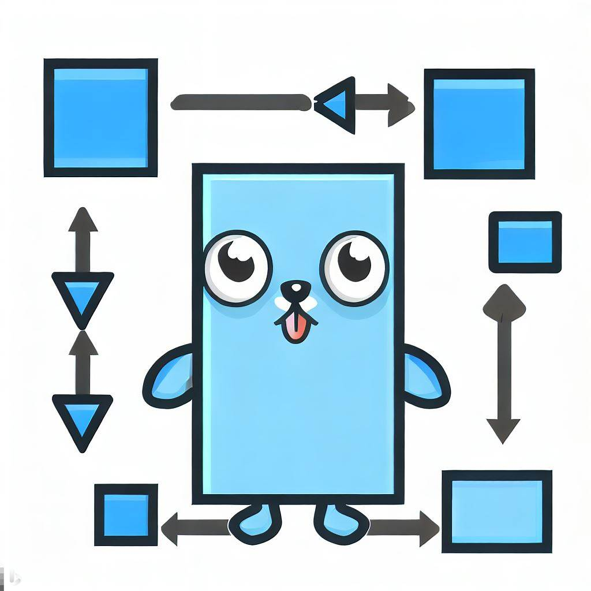

# Code flow 

Visualise a Go program using flow-chart.

## HOW IT WORKS?
* Visit the website.
* Write a go function (with package the name & import statement)
* And click on the generate button. This will generate a flow chart of the given program
* Currently only if-else and for statements are supported.
* Support for other flow control statements (eg. switch, break, continue, etc.) coming soon.

## Todos
* Add support for remaining flow control statements switch, break, continue, etc.
* Document folder structure.